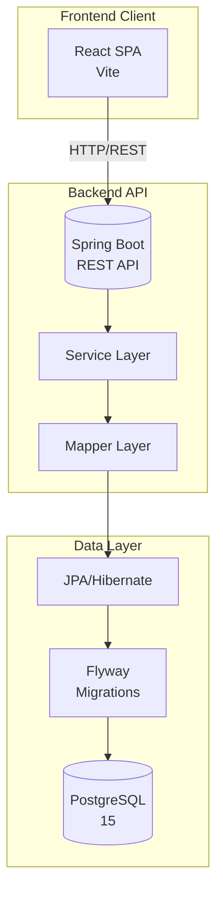
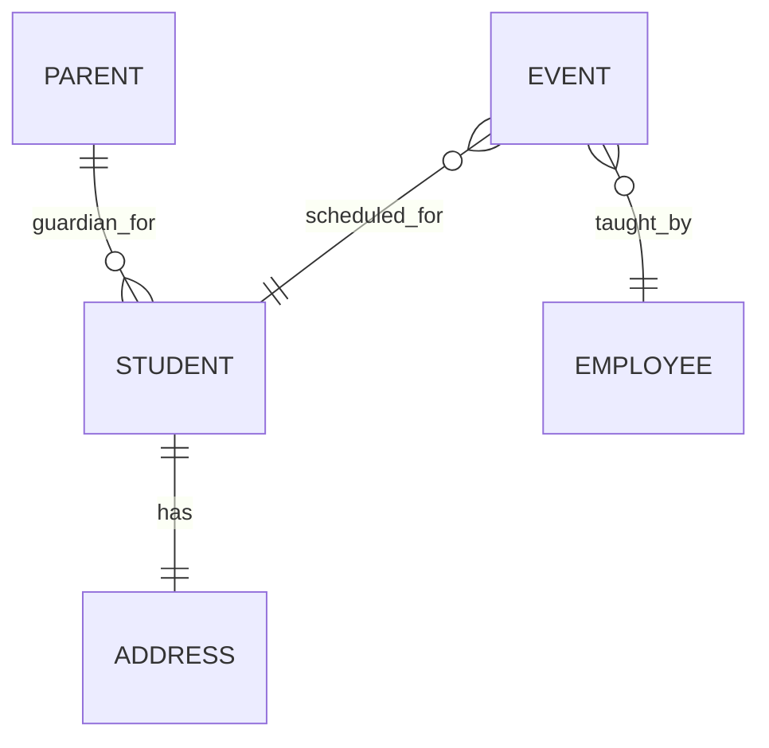
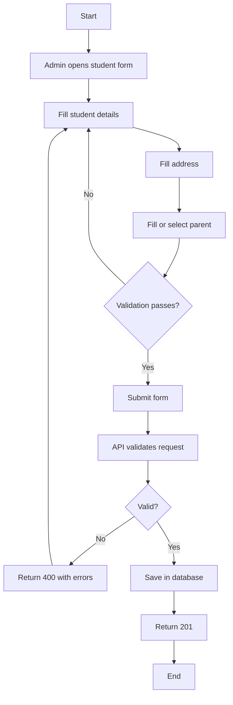
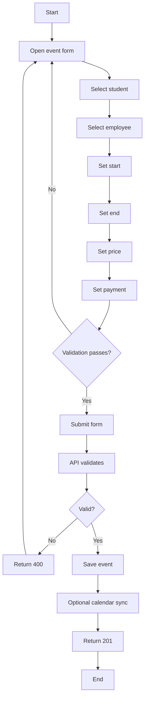
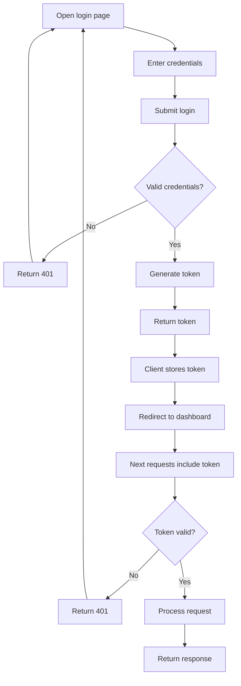

# Diagrams

Shared Mermaid diagrams for planning, architecture, and feature discussions.

## System architecture

## Core domain relationships

## Student registration flow

## Event scheduling flow

## Authentication flow (planned)

