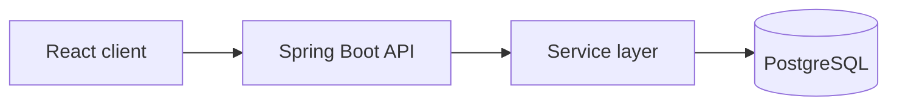
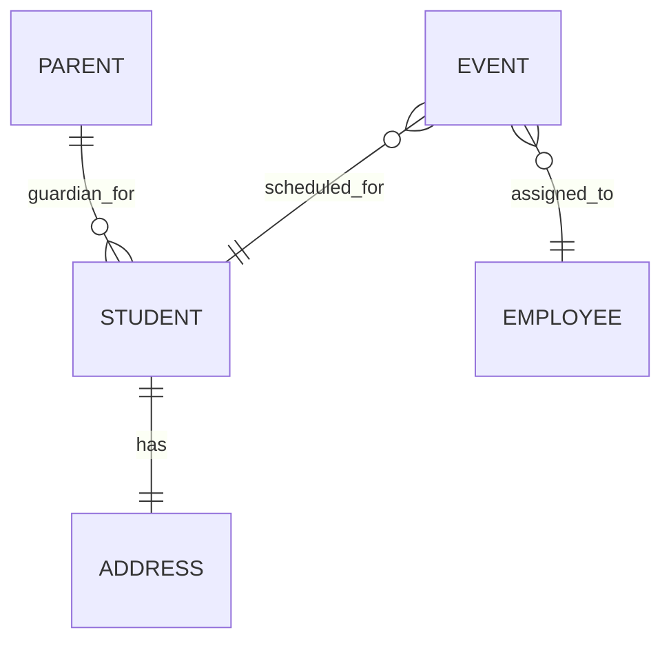

# Project

## Overview

Aprimorar is an internal operations and finance system for a preparatory course center.

The MVP is not a pedagogical platform. Its job is to replace spreadsheets and manual coordination with a simple system for:

- managing students, employees, parents, and events
- recording revenue (`price`) and teacher cost (`payment`)
- calculating profit per event
- showing a monthly financial view

## Product Direction

### MVP Priorities

1. Operational management first.
2. Monthly financial reporting first.
3. Beginner-friendly architecture and docs.
4. Small, obvious delivery slices over large rewrites.

### Explicitly Out of Scope for MVP

- Student portal
- Parent portal
- Pedagogical analytics
- LMS-style learning features
- Payment gateway integration
- Full calendar UI
- Yearly reporting (later phase)

## Core Concepts

### Business Model

| Term | Meaning |
|---|---|
| Revenue | What the student pays for the event (`price`) |
| Cost | What the institution pays the employee (`payment`) |
| Profit | `price - payment` |

### Reporting Rules

- Monthly reporting is required in the MVP.
- Yearly reporting is a later phase.
- Revenue uses event `price`.
- Cost uses event `payment`.
- If `price` or `payment` is missing, event `profit` is `null`.
- Monthly reporting should support:
  - total paid by each student
  - total owed to each employee
  - overall revenue, overall cost, and net profit

## Users and Access

| User | MVP access |
|---|---|
| Admin staff | Full internal access |
| Employees | Internal operational access (after auth/RBAC lands) |
| Students | No portal in MVP |
| Parents | No portal in MVP |

## Current System Shape

### Stack

| Layer | Technology |
|---|---|
| Frontend | React + TypeScript + Vite |
| Backend | Spring Boot + Java 21 |
| Database | PostgreSQL 15 |
| Migrations | Flyway |
| Mapping | MapStruct |

### Architecture

### Data Model

Notes:

- `Student` references one parent/guardian; one parent can be linked to many students.
- Address is embedded in the student model.
- Events carry a required `content` classification.
- Students use archive semantics instead of hard delete.

## Current Product Surface

### Backend/API

- Students: CRUD, archive/unarchive, paginated listing with `includeArchived`
- Employees: CRUD baseline exists
- Parents: active parent summary endpoint exists for selection flows
- Events: CRUD baseline exists with `content`, `price`, and `payment`

### Frontend

- Core navigation exists
- Student, employee, and event management screens exist
- Route-level code splitting exists
- Shared UI primitives and feature-local structure were recently refactored

## Important Decisions

### Locked

1. MVP focus is operations + finance, not pedagogy.
2. Dashboard scope is monthly KPIs, active counts, and upcoming events.
3. Dashboard windows use `America/Sao_Paulo` and event start date.
4. Upcoming events window is the next 15 days, capped at 10 items.
5. Frontend should stay beginner-friendly and avoid overengineering.
6. Frontend structure should follow `pages/`, `components/`, and `utils/` conventions.

### Open Follow-Ups

1. Add a backend dashboard summary endpoint so the dashboard stops aggregating on the client.
2. Return formatted event date/time fields and `profit` directly from the API.
3. Decide whether events should eventually support cancellation state instead of hard delete.
4. Remove risky uniqueness constraints on `name` and possibly `contact`.
5. Re-check event list queries for N+1 behavior.
6. Standardize query parameter validation across controllers.

## Delivery Focus

The next planning slices should favor:

- dashboard/reporting correctness
- parent management inside student flows
- small backend consistency fixes
- auth before broader portals/integrations
- clear separation between calendar sync, calendar UI, reporting, and payment gateway work
