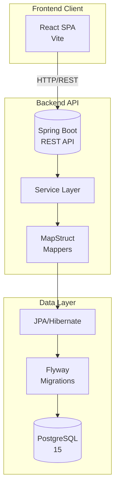
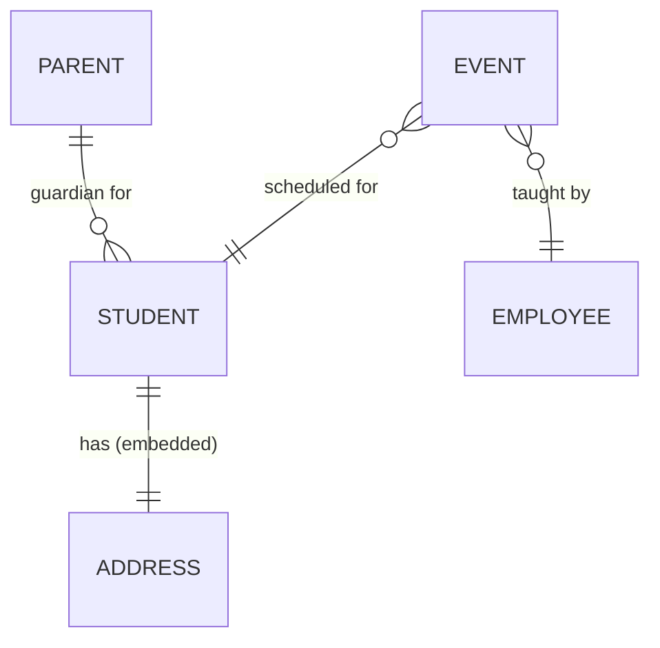
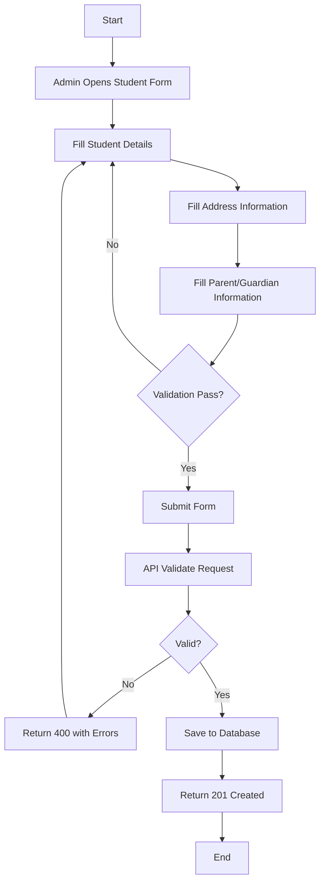
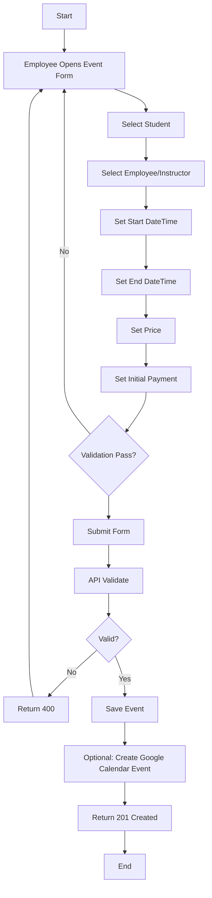
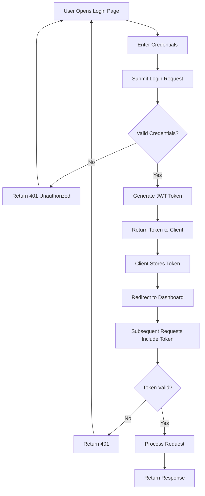

# Project

## Overview
Aprimorar is an educational course management system (MVP) for a preparatory course center that offers:

- Private one-on-one classes: individual sessions scheduled between one student and one teacher.
- Group events/classes: occasional classes for multiple students simultaneously.
- ENEM preparation and mentoring sessions.
- Personal one-on-one mentorship and psychological consulting.

### Business Model

| Component | Description |
|---|---|
| Revenue | Price charged to student per class/event |
| Cost | Payment to teacher per session |
| Profit | Calculated automatically (Revenue - Teacher Payment) |

### Problem Statement

Current manual processes for managing student enrollments, scheduling, payments, and instructor assignments are error-prone and time-consuming. Financial tracking is spreadsheet-based, leading to:

- Difficulty tracking profit per class/event
- No centralized expense tracking
- Manual calculation errors
- Lack of financial visibility

### MVP Focus

The MVP focuses on operational management and financial control (not pedagogical analytics).

### Goals and Objectives

1. Replace manual and spreadsheet-based processes with a centralized internal system
2. Manage student registration and profiles
3. Schedule private classes (one-on-one) and group events
4. Assign teachers to sessions and track session state
5. Record how much each student pays per class/event
6. Record how much each teacher is paid per session
7. Automatically calculate profit per class/event
8. Track institutional expenses
9. Provide a financial overview dashboard (revenue, costs, net profit)

### Stakeholders and Access Model

| Stakeholder | Role | Interest |
|---|---|---|
| Administrators | System administrators | Manage all data, users, and reports |
| Employees | Teachers/Staff | Schedule classes, track sessions |

Notes:

- Student portal and parent/guardian portal are out of scope for the MVP.
- Only administrative staff have access in the MVP.

### Scope

In scope (MVP):

- Student management (registration, profile, contact and basic academic information)
- Event/class management
- Administrative access control (admin staff only)
- Financial module (payments, teacher pay, profit, expenses, dashboard)
- API-first architecture
- PostgreSQL + Flyway migrations
- Spring Boot backend
- React frontend (planned)

Out of scope (future phases):

- Student portal
- Parent/guardian portal
- Pedagogical performance tracking and academic analytics
- Advanced LMS features
- External SaaS multi-tenant capabilities

### Functional Requirements (Legacy)

#### Student Management (FR-001)

| ID | Requirement | Description |
|---|---|---|
| FR-001.1 | Create Student | Create a new student with personal details, address, and parent/guardian information |
| FR-001.2 | List Students | Display all students with pagination support |
| FR-001.3 | List Active Students | Display only active (non-deleted) students with pagination |
| FR-001.4 | Get Student by ID | Retrieve a specific student by their unique identifier |
| FR-001.5 | Update Student | Update student information including address and parent details |
| FR-001.6 | Soft Delete Student | Soft delete (set active=false) instead of physical deletion |
| FR-001.7 | Student Validation | Validate CPF (XXX.XXX.XXX-XX), contact ((XX)XXXXX-XXXX), and email |

#### Employee Management (FR-002)

| ID | Requirement | Description |
|---|---|---|
| FR-002.1 | List Employees | Display all employees with pagination support |
| FR-002.2 | Employee Roles | Support roles: ADMIN, EMPLOYEE, STUDENT, PARENT |
| FR-002.3 | Create Employee | Create employees with role assignment |
| FR-002.4 | Update Employee | Update employee information |
| FR-002.5 | Delete Employee | Support employee deactivation |

#### Event/Class Management (FR-003)

| ID | Requirement | Description |
|---|---|---|
| FR-003.1 | Create Event | Schedule a class/event with start/end datetime, price, payment, student, and employee |
| FR-003.2 | List Events | Display all events with pagination |
| FR-003.3 | Get Event by ID | Retrieve a specific event by ID |
| FR-003.4 | Update Event | Update event details including student and employee assignments |
| FR-003.5 | Delete Event | Delete events (see Decisions for MVP semantics) |
| FR-003.6 | Event Validation | Ensure end datetime is after start datetime |
| FR-003.7 | Payment Validation | Ensure payment does not exceed price |
| FR-003.8 | Event Session Type | Event must include a required `sessionType` enum (CLASS_1ON1, CLASS_GROUP, MENTORSHIP_1ON1, PSYCHOLOGICAL_CONSULTING) |

#### Activity Types (FR-004)

| ID | Requirement | Description |
|---|---|---|
| FR-004.1 | ENEM Activity | Support ENEM preparation activity type |
| FR-004.2 | Mentoria Activity | Support mentoring (Mentoria) activity type |

#### Parent/Guardian Management (FR-005)

| ID | Requirement | Description |
|---|---|---|
| FR-005.1 | Create Parent | Allow creating parent/guardian records linked to students |
| FR-005.2 | Parent Data | Store parent name, email, contact, and CPF |

#### Address Management (FR-006)

| ID | Requirement | Description |
|---|---|---|
| FR-006.1 | Embedded Address | Store address as embedded object within student entity |
| FR-006.2 | Address Fields | Support street, city, state, zip code |

#### Pagination (FR-007)

| ID | Requirement | Description |
|---|---|---|
| FR-007.1 | Paginated Lists | All list endpoints support pagination with configurable page size |
| FR-007.2 | Default Page Size | Default page size 20, maximum 100 |
| FR-007.3 | Sorting | Results sortable by specified fields |

#### Data Validation (FR-008)

| ID | Requirement | Description |
|---|---|---|
| FR-008.1 | CPF Validation | CPF follows XXX.XXX.XXX-XX |
| FR-008.2 | Contact Validation | Contact follows (XX)XXXXX-XXXX |
| FR-008.3 | Email Validation | Email format validation |
| FR-008.4 | Date Validation | Birthdate must be in the past |
| FR-008.5 | Required Fields | Mandatory fields validated |
| FR-008.6 | Student Age Range | Student age must be within a defined min/max range |

#### Error Handling (FR-009)

| ID | Requirement | Description |
|---|---|---|
| FR-009.1 | Not Found Responses | Return 404 for non-existent resources |
| FR-009.2 | Validation Errors | Return 400 with detailed validation messages |
| FR-009.3 | Data Integrity Errors | Return 409 for constraint violations |
| FR-009.4 | Global Exception Handler | Exceptions handled centrally |

## Tech Stack

| Layer | Technology | Version/Notes |
|---|---|---|
| Frontend | React + TypeScript | 18.3.1 |
| Build tool | Vite | 6.x |
| Styling | Tailwind CSS | 4.x |
| State | Zustand | 5.x |
| Routing | React Router | 7.x |
| HTTP | Axios | 1.x |
| Backend | Java | 21 |
| Framework | Spring Boot | 3.5.7 |
| Database | PostgreSQL | 15 |
| Migrations | Flyway | via Spring Boot |
| Mapping | MapStruct | 1.5.5.Final |
| OpenAPI docs | SpringDoc OpenAPI | 2.8.9 |
| Testing | JUnit, Mockito | via Spring Boot |
| Containerization | Docker | latest |

Policy:

- Frontend: TypeScript only (.tsx/.ts). No vanilla JavaScript.

## Architecture

### System Architecture



### Repository Structure

Current structure:

```
aprimorar/
├── client/                    # React frontend
├── server/                    # Java backend
└── docs/                      # Project and planning docs
```

### Non-Functional Requirements (Legacy)

#### Performance (NFR-001)

| ID | Requirement | Target |
|---|---|---|
| NFR-001.1 | API Response Time | < 200ms for simple queries |
| NFR-001.2 | Pagination Performance | Database-side pagination (OFFSET/LIMIT) |
| NFR-001.3 | Query Optimization | Avoid N+1 query problems |

#### Scalability (NFR-002)

| ID | Requirement | Description |
|---|---|---|
| NFR-002.1 | Horizontal Scaling | Backend stateless design allows horizontal scaling |
| NFR-002.2 | Database Connection Pool | Use HikariCP |
| NFR-002.3 | Session Management | Stateless authentication for scalability |

#### Security (NFR-003)

| ID | Requirement | Status | Notes |
|---|---|---|---|
| NFR-003.1 | Input Validation | Implemented | Bean Validation annotations |
| NFR-003.2 | SQL Injection Prevention | Implemented | JPA/Hibernate ORM |
| NFR-003.3 | Authentication | Missing | No JWT or session-based auth implemented |
| NFR-003.4 | Authorization | Missing | No role-based access control |
| NFR-003.5 | Secure Password Storage | Missing | No password hashing implemented |
| NFR-003.6 | HTTPS/TLS | Missing | No SSL configuration |
| NFR-003.7 | CORS Configuration | Missing | No CORS policy defined |
| NFR-003.8 | Rate Limiting | Missing | No API rate limiting |

#### Reliability (NFR-004)

| ID | Requirement | Description |
|---|---|---|
| NFR-004.1 | Database Migrations | Flyway for version-controlled migrations |
| NFR-004.2 | Logging | SLF4J logging in services |
| NFR-004.3 | Timestamp Tracking | createdAt and updatedAt on entities |

#### Maintainability (NFR-005)

| ID | Requirement | Description |
|---|---|---|
| NFR-005.1 | Clean Architecture | Controller/service/repository separation |
| NFR-005.2 | DTO Pattern | DTOs for API contracts |
| NFR-005.3 | MapStruct | Type-safe bean mapping |
| NFR-005.4 | OpenAPI Documentation | SpringDoc for API docs |
| NFR-005.5 | Code Coverage | JaCoCo configured |
| NFR-005.6 | TypeScript-Only Frontend | All React code uses TypeScript (.tsx/.ts) |

### Configuration Requirements (Legacy)

Environment variables (example):

```bash
# Database
SPRING_DATASOURCE_URL=jdbc:postgresql://localhost:5432/aprimorar
SPRING_DATASOURCE_USERNAME=myuser
SPRING_DATASOURCE_PASSWORD=mpassword

# Application
SERVER_PORT=8080
SPRING_PROFILES_ACTIVE=dev
```

Prerequisites:

- PostgreSQL 15 database
- Java 21 runtime
- Node.js 18+ (for React development)
- Docker and Docker Compose (optional for dev isolation)

### Success Criteria (Legacy)

Functional:

- [ ] Student registration and profile management working
- [ ] Private class scheduling (one-on-one) operational
- [ ] Group event scheduling operational
- [ ] Teacher assignment to sessions working
- [ ] Session state tracking (scheduled, completed, cancelled) functional
- [ ] Student payment recording per class/event
- [ ] Teacher payment recording per session
- [ ] Automatic profit calculation per class/event
- [ ] Expense tracking for institutional costs
- [ ] Financial dashboard showing revenue, costs, net profit

Technical:

- [ ] Authentication and authorization for admin staff
- [ ] API response times < 200ms
- [ ] Frontend UI for management features
- [ ] Database integrity and migrations

Business value:

- [ ] Replace spreadsheet-based financial tracking
- [ ] Centralize operational system
- [ ] Provide real-time profit visibility per service

### Reality Check (Legacy, 2026-02-27)

- Employee CRUD endpoints exist (`/v1/employees`, `/v1/employees/active`, `/v1/employees/{id}` plus create/update/delete)
- Parent API currently exposes only `/v1/parents/active` (summary list)
- Event entity already has `title` and `description` fields
- Event controller has a TODO about N+1 queries
- Student, Parent, and Employee tables currently have a unique constraint on `name`

## Data Model

Conceptual notes aligned with current backend modeling:

- A Parent can be linked to many Students (Student has a many-to-one reference to Parent).
- Address is an embedded value object inside Student.
- Activity and Role are enums.
- Event includes a `sessionType` enum (service provided), distinct from Student `activity`.



## API

### Base Path

- Base path: `/v1`
- Swagger UI (dev): `http://localhost:8080/swagger-ui.html`

### Endpoints (Current)

Students

| Method | Endpoint | Description |
|---|---|---|
| GET | `/v1/students` | List all students (paginated) |
| GET | `/v1/students/active` | List active students |
| GET | `/v1/students/{id}` | Get student by ID |
| POST | `/v1/students` | Create new student |
| PATCH | `/v1/students/{id}` | Update student |
| DELETE | `/v1/students/{id}` | Soft delete student |

Employees

| Method | Endpoint | Description |
|---|---|---|
| GET | `/v1/employees` | List all employees (paginated) |
| GET | `/v1/employees/active` | List active employees |
| GET | `/v1/employees/{id}` | Get employee by ID |
| POST | `/v1/employees` | Create employee |
| PATCH | `/v1/employees/{id}` | Update employee |
| DELETE | `/v1/employees/{id}` | Soft delete employee |

Events

| Method | Endpoint | Description |
|---|---|---|
| GET | `/v1/events` | List all events (paginated) |
| GET | `/v1/events/{id}` | Get event by ID |
| POST | `/v1/events` | Create new event |
| PATCH | `/v1/events/{id}` | Update event |
| DELETE | `/v1/events/{id}` | Delete event (currently hard delete) |

Parents

| Method | Endpoint | Description |
|---|---|---|
| GET | `/v1/parents/active` | List active parents (id + name only) |

## Diagrams

### Student Registration Flow



### Event Scheduling Flow



### Authentication Flow (Planned)



## Decisions

### Decisions and Open Questions

1. Event cancellation vs deletion: requirements mention session state; current API implements hard delete for events. MVP should define whether deletion is allowed, or whether events are kept and marked CANCELLED.
2. Authentication approach: JWT-based auth is planned; define credential source and initial admin provisioning.
3. Authorization matrix: define which roles can do what (admin vs employee). Student/parent roles exist as enums but are out of scope for MVP access.
4. Uniqueness constraints: current schema enforces unique `name` for Student/Parent/Employee; this is risky in real domains and should be revisited.
5. Frontend placement: `client/` exists and contains the Vite + React + TypeScript app.
6. Privacy hardening: confidential session types (MENTORSHIP_1ON1, PSYCHOLOGICAL_CONSULTING) are treated as normal events for MVP; add stricter access controls and audit logging as a follow-up.

### MVP Decisions (Locked)

1. Dashboard scope: MVP includes monthly KPIs (revenue, cost, profit), active counts, and an upcoming events list. Full calendar view and dashboard graphics are post-MVP.
2. Dashboard windowing: KPIs are based on event start date, for the current month in America/Sao_Paulo, and include all scheduled events in that month.
3. Upcoming list: next 15 days, limited to 10 items, with date, start time, title, student, employee, price, and profit.
4. Profit definition: profit = price - payment. If price or payment is missing, profit is null.
5. DTO formatting: Event responses add formatted date/time fields (dd/MM/yyyy, HH:mm) while keeping startDateTime/endDateTime for compatibility.
6. Frontend responsiveness: page-level responsive/layout rules live in a colocated CSS Module (e.g. `SomePage.tsx` + `SomePage.module.css`).
